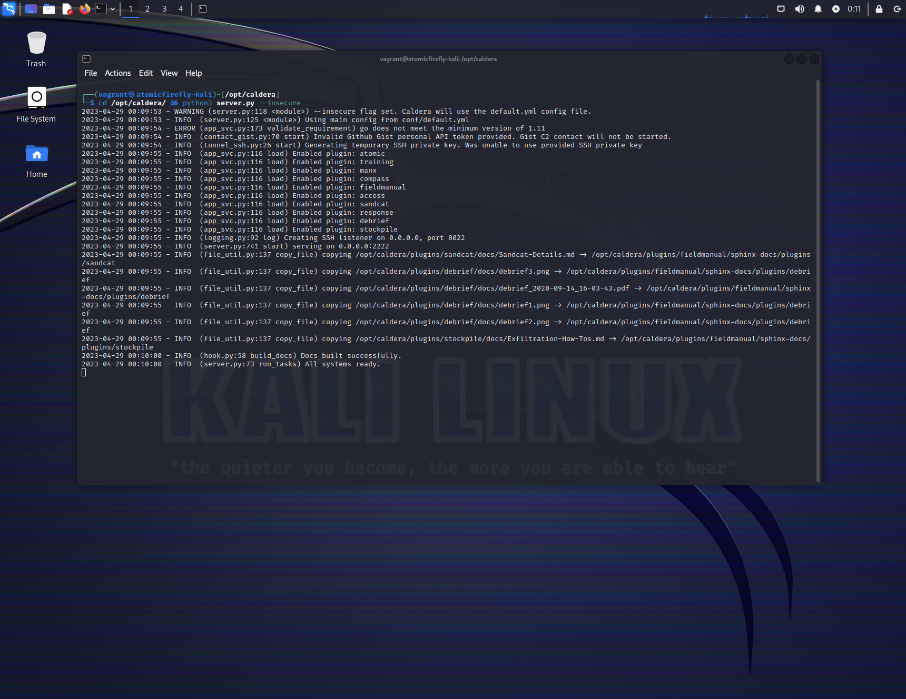
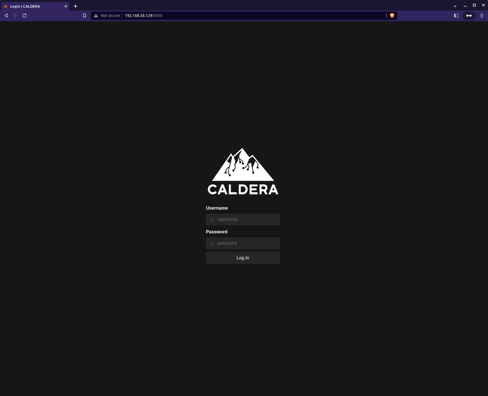

# Tartarus
Tartarus (renamed from AtomicFireFly), is designed to automate the process of deploying and testing security products. This solution consists of a single node ElasticSearch cluster on a Rocky8 Linux guest (for CentOS/RHEL cross compatibility). The Windows node features Sysmon, Elastic Agent, and Atomic Red Team. Additionally, a Kali Linux instance with Caldera pre-packaged ensures comprehensive testing and monitoring.  

## Requirements (host)
### Hardware
RAM - 17 GB  
CPU - 9 Cores*  
Storage - 50 GB  
*Most modern CPUs have "virtual cores" so if you have 4 physical cores you'll have 8 virtual.  
RAM and Core count can be tweaked in the Vagrantfile.  
You don't have to bring up all systems at once, if you are just testing Windows 12 GB of RAM and 6 CPU Cores (3 physical) is enough.  

### Software
[VirtualBox](https://www.virtualbox.org/wiki/Downloads)  
[Vagrant](https://developer.hashicorp.com/vagrant/downloads)  

## Nodes (guests)

| VM Name               | Operating System                     | CPU Cores | Memory (MB) | Private IP     | Components                                                        |
|-----------------------|--------------------------------------|-----------|-------------|----------------|-------------------------------------------------------------------|
| tartarus-elastic      | bento/rockylinux-8.7                 | 4         | 8192        | 192.168.56.10  | ElasticSearch, Kibana, Fleet, Smallstep CA, Caddy                 |
| tartarus-linux        | bento/rockylinux-8.7                 | 1         | 1024        | 192.168.56.20  | Elastic Agent                                                     |
| tartarus-windows      | gusztavvargadr/windows-10-21h2-enterprise | 2    | 4096        | 192.168.56.30  | Elastic Agent, Sysmon, Atomic Red Team                            |
| tartarus-kali         | kalilinux/rolling                    | 2         | 4096        | 192.168.56.129 | Caldera                                                           |  

### IP Addresses 
| Reserved for         | IP Address Range |
|----------------------|------------------|
| Networking           | 1-9              |
| Security devices     | 10-19            |
| Linux hosts          | 20-29            |
| Windows hosts        | 30-39            |
| Adversaries          | 128+             |  

The Kali instance gets such a high IP so if an Opnsense firewall is added Kali can be out of "homenet" with a /25 network.  
There is an issue of it reassigning itself an IP after ~10 min, am investigating.  

## Note
**This is not for production!**  
Please use as a guide / lab only, I do things like placing the elastic user password in a file  
This should never be done in prod!  
If an adversary gets you Elastic super-user password or root access to a node it is **GAME OVER!**  

## Setup  
Bring up Elastic, Windows, Linux, Kali or all hosts with the following commands.  
The Elastic cluster has to be started first if you want telemetry data!  

### Build
Provisions the VMs ready for use.  
#### Elastic + Windows  
`vagrant up elastic windows`  
#### Elastic + Linux  
`vagrant up elastic linux`  
#### Elastic + Linux + Windows
`vagrant up elastic linux windows`  
#### Elastic + Kali  
`vagrant up elastic kali`  
#### Elastic + Kali + Windows  
`vagrant up elastic kali windows`  
### Login  
#### Elastic  
`vagrant ssh elastic`  
#### Linux  
`vagrant ssh linux`  
#### Windows  
`vagrant ssh windows`  
On Windows open RDP client and connect to `127.0.0.1:53389`  
Username: vagrant  
Password: vagrant  
If you have `xfreerdp` installed on Linux (change /size to whatever you want, cert ignore is to dismiss the untrusted cert warning on first login, the 127.0.0.1 can also be changed to a remote address if needed)  
`xfreerdp /u:"vagrant" /p:"vagrant" /v:127.0.0.1:53389 /size:1300x700 /cert:ignore`  
#### Kali  
Should popup with a GUI at first boot (remember to enable x11 if you are remote)  
`vagrant ssh kali`  
Username: vagrant  
Password: vagrant  

### Suspend
All data is saved just shuts down the VM.  
#### Elastic  
`vagrant halt elastic`  
#### Linux  
`vagrant halt linux`  
#### Windows  
`vagrant halt windows`  
#### Kali  
`vagrant halt kali`  

### Re-build
Be careful here you will lose all data internal to each VM if you do this!  
All main apps (Elasticsearch, Kibana, Agents, Sysmon, Go, Git except Caldera and Atomic Red Team) won't be redownloaded and are safe in the apps/ dir, however their configs and internal data like the Elasticsearch database, any custom Kibana dashboards, alerts, etc. will be deleted and reprovisioned. You have been warned!  
#### Elastic  
`vagrant destroy elastic`  
`vagrant up elastic --provision`  
#### Linux  
`vagrant destroy linux`  
`vagrant up linux --provision`  
#### Windows  
Reprovisioning Windows will redownload Atomic Red Team every time as it doesn't go to the /apps dir!  
`vagrant destroy windows`  
`vagrant up windows --provision`  
#### Kali  
Reprovisioning Kali will redownload Caldera every time as it doesn't go to the /apps dir!  
`vagrant destroy kali`  
`vagrant up kali --provision`  

### DNS settings
We use `.home.arpa.` to conform with [RFC8375](https://www.rfc-editor.org/rfc/rfc8375.html)   
#### Local 
Replace (Vagrant host ip) with the IP of the host machine you will run Vagrant from  
Windows Powershell  
`Add-Content 'C:\Windows\System32\Drivers\etc\hosts' "192.168.56.10 tartarus-elastic.home.arpa"`  
Linux Bash  
`echo "192.168.56.10 tartarus-elastic.home.arpa" >> /etc/hosts`  
#### Remote
Used for remote deployments
Replace (Vagrant host ip) with the IP of the host machine you will run Vagrant from  
Windows Powershell  
`Add-Content 'C:\Windows\System32\Drivers\etc\hosts' "(Vagrant host ip) tartarus-elastic.home.arpa"`  
Linux Bash  
`echo "(Vagrant host ip) tartarus-elastic.home.arpa" >> /etc/hosts`  

## Kibana  
It is safe to ignore the HTTPS certificate warning as we generated our own self-signed certs in this instance.  
You can now add the generated CA certificate saved in ./certs/ to your browser trust store and you will never see a this site is insecure" again* for this project thanks to the Smallstep CA + Caddy ACME certificate setup  
*The certs last 24 hours and sometimes Caddy (if you leave your host in hibernation for a while) the cert expires. A simple `sudo systemctl restart caddy` on the `tartarus-elastic` node and you'll be golden  
**Log into Kibana (local)**  
From your host machine   
`https://tartarus-elastic.home.arpa:5443`  
Must be via domain name now due to Caddy reverse proxy, just add an override in `/etc/hosts` or `C:\Windows\System32\drivers\etc\hosts` to point `tartarus-elastic.home.arpa` to `192.168.56.10`
**Log into Kibana (remote)**  
`https://tartarus-elastic.home.arpa:5443`  
  
Username: `elastic` 
You can save the password in a file called "Password.txt" in the directory you ran Vagrant from, this is the password to the Superuser account so be careful!  
The file is in `.gitignore` however it's not good practice to save passwords to disk!  
The password is also printed to the terminal / shell you ran `vagrant up` from.  

## Viewing Kibana Alerts
Once you have logged into the Kibana instance on `https://tartarus-elastic.home.arpa:5443` now it is time to view the alerts.  
The Windows and Linux alerts are auto enabled for you.  
Search for alerts in the universal search tab, or open the burger and scroll down to the security tab.  
  
Now search for "alerts".  
  
You should see the alerts page (Note you might not have any alerts yet, you'd need to start the Windows host and run the  EDR-Telemetry-Generator for example)  

## Atomic Red Team Tests
Using the EDR-Telemetry-Generator from [EDR-Telemetry](https://github.com/tsale/EDR-Telemetry)  
Open PowerShell and Git clone the EDR-Telemetry project and run it, Git is pre-installed for ease of use.  
`git clone https://github.com/tsale/EDR-Telemetry.git`  
It goes without saying but this should only be run on a VM, don't run it on your host OS!  
`& .\EDR-Telemetry\Tools\Telemetry-Generator\telemetry-generator.ps1`

Now look at the Kibana alerts dashboard.  

## Caldera Tests
Now start Caldera and log in.  
`vagrant up kali` to start the Kali instance.  
Bring up Caldera with `cd /opt/caldera/ && python3 server.py --insecure`  
  
Now log into Caldera `http://192.168.56.129:8888/`  
If you have issues accessing it run `ifconfig eth1` in a new shell window and note down the IP results if different than the default and connect to that instead.  
Username: red  
Password: admin  
  
Now you can do the usual. I highly recommend the in platform training for a better understanding.  

## Inspirations
The main inspiration for this work is from the incredible project [EDR-Telemetry](https://github.com/tsale/EDR-Telemetry)  
The use of Vagrant as a provisioner was inspired by [Jeff Geerling's](https://github.com/geerlingguy) excellent book Ansible for DevOps.  

## Resources
### TryHackMe
[Atomic Red Team](https://tryhackme.com/room/atomicredteam)  
[Elastic](https://tryhackme.com/room/investigatingwithelk101)  
### GitHub
[EDR-Telemetry](https://github.com/tsale/EDR-Telemetry)  
[Caldera](https://github.com/mitre/caldera)  
[Elastic](https://github.com/elastic)
[Atomic Red Team](https://github.com/redcanaryco/atomic-red-team)
[Sigma](https://github.com/SigmaHQ/sigma)
[Caddy](https://github.com/caddyserver/caddy)
[Smallstep](https://github.com/smallstep/certificates)

## TODO
Look into how ART works on Linux  
Think about a config file to hold variables that all scripts can pull from, like hostname, IP_ADDR, VER, etc. Could be done with an improvised `.env` file and functions to export all vars local to each script?  
~~Think about password saving~~  
Add a new API call to create an API user and use that for all other curl authentications and then the API key can be shipped to other projects   
Add Windows 2022 Server promoted to domain controller 
~~Add the Auditd and Sysmon updates from Florin~~

## Future improvements
Add an Opnsense node  
Add a Remnux/CSI Linux node  
Use Ansible to provision all the nodes for true idempotence  
Look into a cloud deployment mode of Elastic like I did in https://github.com/ScioShield/Elastic-Cloud-Agent for those who don't have 64GB RAM :) This will need two scrips (a .ps1 and a .sh) to do all the config and change the Vagrantfile. I'd rather provisioning happen on the host and the guest can be as isolated as needed.  
